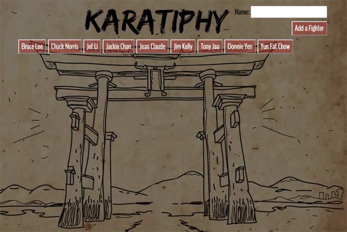

<h1 align="center">GifTastic</h1>

<kbd></kbd>
 

This repo is an interactive Giphy App.  The App interfaces with the Giphy API to populate selected gifs.  First a list of preset buttons are created that display a famous martial artists.  When a button is clicked, it will display a carousel of 10 images related to the artist. The images are initially still images, but when clicked, the images will animate.  To stop the animation click the image again.  The user can also enter their own artist by typing their name into the input field and clicking the "Add Fighter" button.  A new button will be created in the button display.  When clicked, the carousel will populate with ten images of the selected artist.  The app displays the following:
1. Prepopulated Buttons
1. User Input Field
1. Add Fighter Button
1. Image Rating
1. Image Carousel
# Demo
*https://tlockhart.github.io/GifTastic/
## Setup
In order to run the app, you will need to run the index.html file on a computer with a web browser and internet access.  After cloning the repository, you can edit the files in your IDE of choice.  The main files are:
1. index.html
1. assets/javascript/app.js
1. assets/css/style.css
## Technologies Used
1. Giphy API
1. Bootstrap
1. JQuery
1. JavaScript
1. CSS3
1. HTML5
## Use
This repo is available for public non-commercial use only.
## Goal
The goal of this project was to create a karate themed, interactive Giphy App, that dynamically generates a web page with JavaScript and JQuery.

